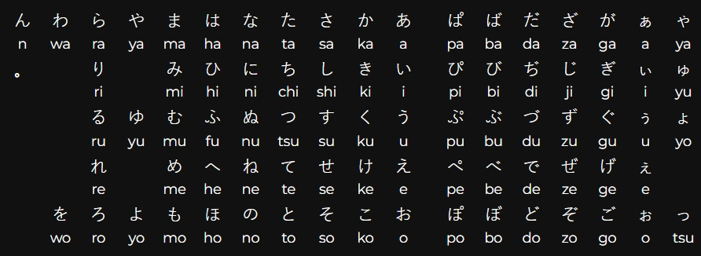

# nintendo-switch-2-keyboard-symbols
Every unicode symbol you can use as your profile name on the Nintendo Switch 2

## Description

I recorded this data because it was necessary to make it possible for me to validate replay file names for a certain game.
The symbols are ordered by when they appear when cycling through the keyboards.

For every keyboard, I read the symbols from left to right. 
I started with the `English (UK)` keyboard, and ended after reading all the pages of the `Symbol` keyboard.

After going through every page of one of these keyboards (ABC, #+=, ÀÁÂ) I press the joystick button to enable the SHIFT modifier.
If the SHIFT modifier makes any new characters appear, I write down those that haven't appeared before.

The Japanese 50 keyboard is an outlier in that not all the symbols can be written with a single A-button press.
I therefore followed the order of hiragana symbols seen in this picture. 
`ん` and `を` appear in different order than that screenshot suggests because of how these characters are ordered on the Nintendo Switch 2 keyboard.
This happens in katakana too with `ン` and `ヲ`

## Disclaimer

I'm unsure if the symbol `ˊ` is correct as I don't know too much about fonts. It's hard to see differences between these single quote symbols.
I'm also unsure about the `⌾`symbol, as there are some unicode symbols that look identical to it in certain fonts. 
If you don't think you'd do a more accurate job, save yourself the time and just use this. This took me 3 hours.

## All the symbols, no repeats, grouped by keyboard appearances (Normal + modifier),

1234567890-
qwertyuiop/
asdfghjkl:'
zxcvbnm,.?!

#£€$^&*()_
QWERTYUIOP
ASDFGHJKL;"
ZXCVBNM<>+=

~`{}|[]

àáâãäåæāăąç
ćċčðďdždzèéêë
ēęěğġģħìíîï
īįıijķĺļľł

ÀÁÂÃÄÅÆĀĂĄÇ
ĆĊČÐDžDzÈÉÊË
ĒĘĚĞĠĢĦÌÍÎÏ
ĪĮİIJĶĹĻĽŁ

ñńņňòóôõöøœ
őŕřšßśşþťț
ùúûüūůűųýÿź
żž

ÑŃŅŇÒÓÔÕÖØŒ
ŐŔŘŠŚŞÞŤȚ
ÙÚÛÜŪŮŰŲÝŸŹ
ŻŽ

º

ª

ъ
йцукенгшщзх
фывапролджэ
ячсмитьбю

ЙЦУКЕНГШЩЗХ
ФЫВАПРОЛДЖЭ
ЯЧСМИТЬБЮ

「わらやまはなたさかあぱばだざがぁゃ
」をりみひにちしきいぴびぢじぎぃゅ
ーんるゆむふぬつすくうぷぶづずぐぅょ
？、れめへねてせけえぺべでぜげぇ
！。ろよもほのとそこおぽぼどぞごぉっ

ワラヤマハナタサカアパバダザガァャ
ヲリミヒニチシキイピビヂジギィュ
ンルユムフヌツスクウプブヅズグゥョ
レメヘネテセケエペベデゼゲェ
ロヨモホノトソコオポボドゾゴォッ

¥〜【】・※〃ゝ〆々仝

¿¡
‘’‚‛
…“”„
«»←→↑↓⇒⇔
¢ƒ¤

´×÷±∞√¬
Ɐ⊂⊃∴∵⏜µ№°ˊ∂
¹²³¼½¾♪♭♀♂
○●⌾□■◇◆△▲▽▼
☆★©®™§¶†₸

αβγδεζηθικλμνξοπρστυφχψω
ΑΒΓΔΕΖΗΘΙΚΛΜΝΞΟΠΡΣΤΥΦΧΨΩ
